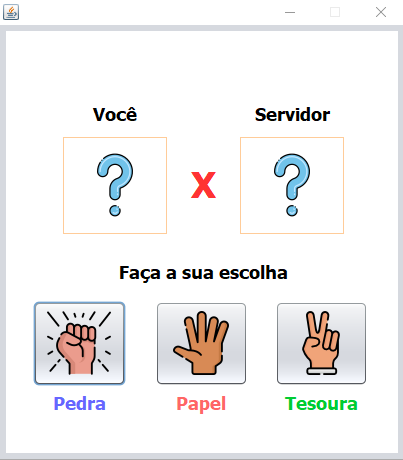
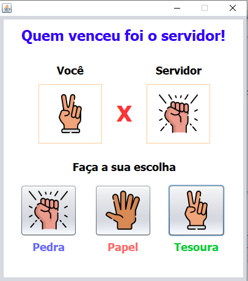

# Simple Rock, Scissors, Paper Game
## This game was developed to ilustrate the distributed objects concept, using RMI (Remote Method Invocation) from Java programming language. 

## Interface

  
  

 ALL icons made by <a href="https://www.freepik.com" title="Freepik">Freepik</a> from <a href="https://www.flaticon.com/" title="Flaticon">www.flaticon.com</a>

